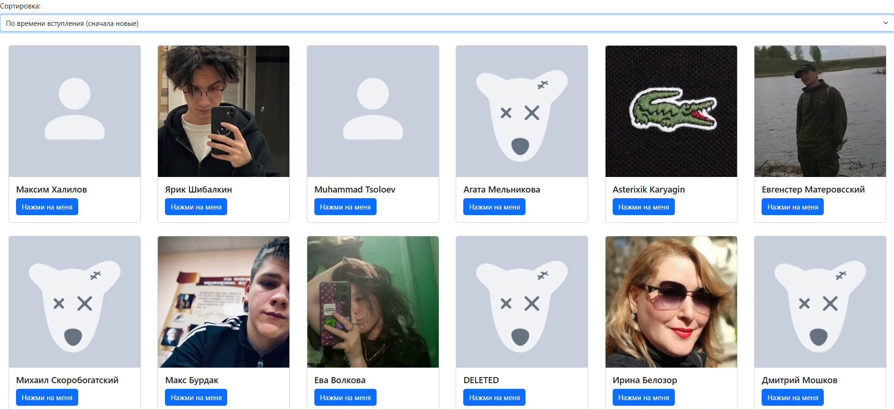

# Скриншоты

# Выполненые задания

- Основные
    - Знакомство с XMLHttpRequest
    - Работа с VK Api
    - Api главной страницы
    - Api страницы пользователя
    - Вариант 1: получить список пользователей группы и отобразить их + добавлен компонент sort. И отобразить данные пользователей.

- Задание с практики
    - Использовать axios для отправки запросов.(Файл ajax.js (Исходный код с Ajax предствлен в коде в комментариях)).