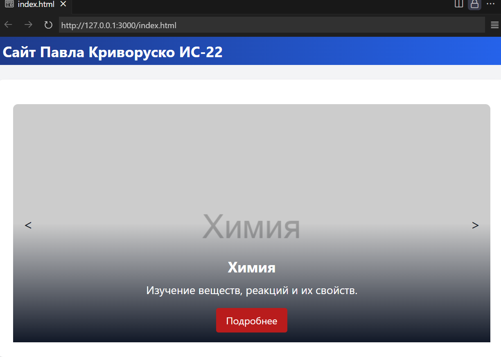
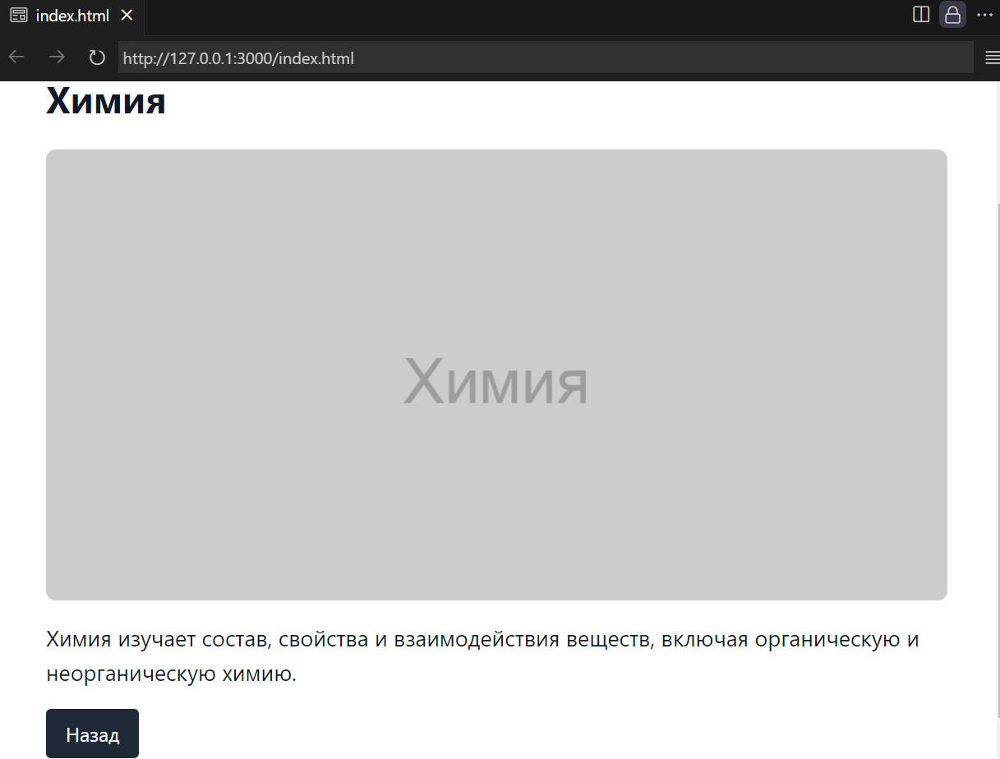

# Скриншоты

# Выполненые задания

## Основные

- Знакомство с node, npm, написание простого приложения на JavaScript.
- Ознакомиться с кодом реализации простого интерфейса и вывода данных, и затем выполнить задания по варианту. (Я выбрал вариант 4 "Учебные предметы - карусель.")

## Задание с практики

- Расссказать про tailwind и проверстать с помощью него весь код.
    - Tailwind CSS — CSS-фреймворк с открытым исходным кодом. Особенность этой библиотеки в том, что она не предопределяет CSS-классы отдельных элементов. Вместо этого она предоставляет служебные классы, которые можно объединять для стилизации каждого элемента. 
