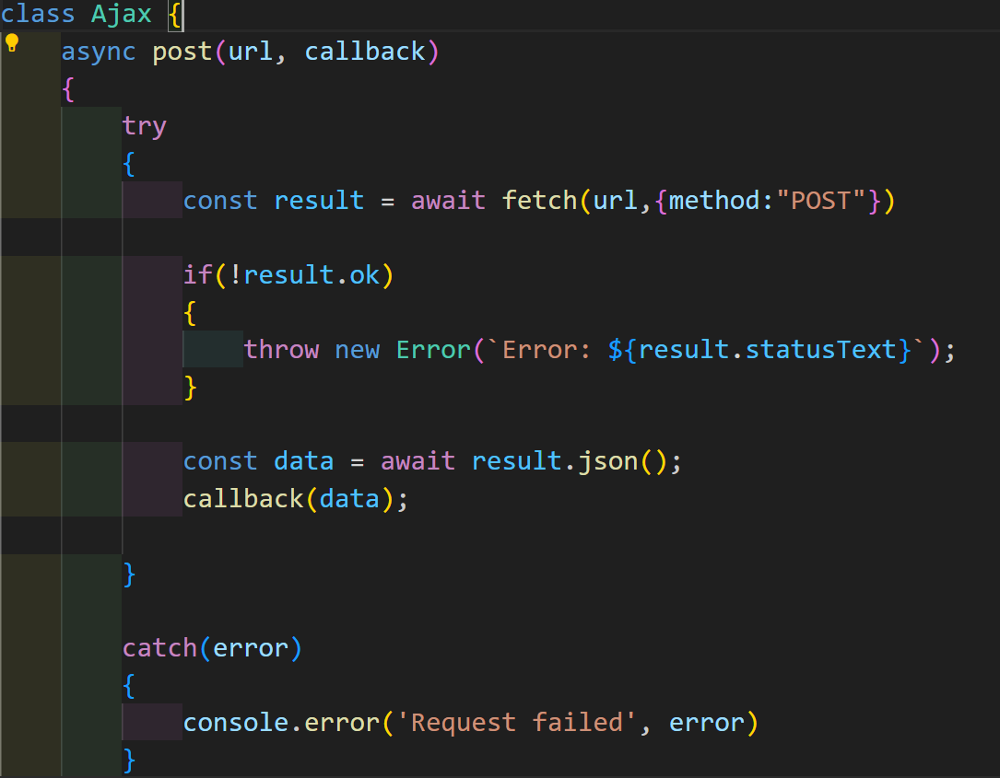

# ЛР 5. Простое веб-приложение. Работа с Api (Продолжение)

## Цель

- Целью данной лабораторной работы также является взаимодействие с внешним Api. Но если в прошлой лабораторной работе мы это делали с помощью XMLHttpRequest, то в этот раз мы будем пользоваться более современным "инструментом" - fetch.

# Скриншоты

## Задачи, которые нужно было выполнить

- Нам необходимо доработать лабораторную работу номер 4. Также по своему варинту, нам нужно заменить все вызовы и использования XMLHttpRequest на fetch.