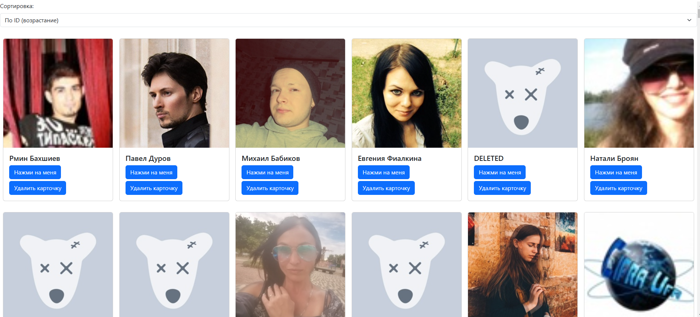

# ЗАДАНИЕ
- Необходимо в наши проекты с 3-5 лабораторную работу добавить возможность добавления и удаления карточек.
- Удалить все getData() и заменить их на походы в написанное нами API.
- Написать бэкенд на Node.js на примере данного, который будет возвращать данные (которые раньше лежали в getData) для нашего приложения.

- Задание с практики
    - Переделать на nest js. (к сожалению, папка с nest не добавляется)

# Скриншот

