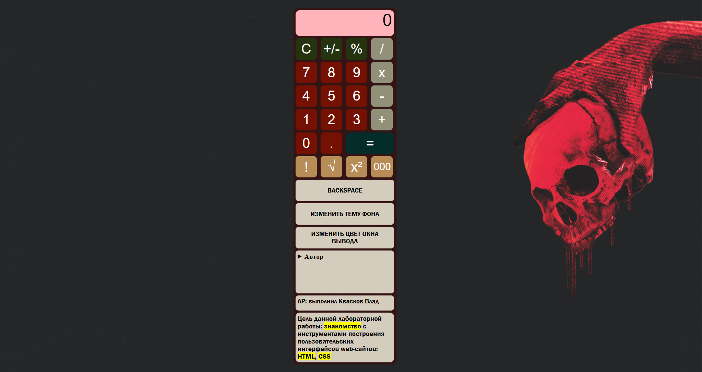
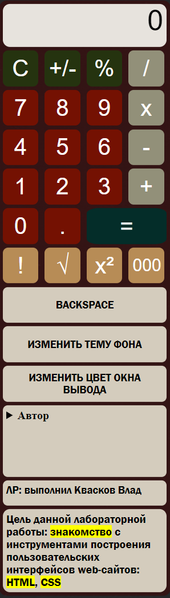

# Скриншоты
### Вся страница калькулятора:

### Окно калькулятора:


# Выполненые задания
### Основные
- Ознакомился с HTML, CSS
- Создал макет калькулятора 
### Дополнительные
- Поменял цветовую палитру калькулятора всех кнопок;
- Изменил фон калькулятора;
- Изменил форму кнопок;
- Изменил цвет поля вывода результата;
- Скруглил края поля вывода;
- Поменял шрифт цифр;
- Изменил цвет при наведении мышки на кнопку на другой;
- Добавил надпись "ЛР выполнена ФИО";
- Выровнял калькулятор по центру;
- Добавил кнопку для смены темы;
- Добавил кнопку для смены окна результата;
- Сделал шрифт тольще;
- Сделал шрифт тоньше;
- Сменил цвет шрифта;
- Добавил изображение на фон;
- Добавил кнопку со ссылкой на GitHub(находиться внутри разворачивающегося списка с информацией);
- Реализовал сворачивающиеся и разворачивающиеся подробности;
- Реализовал поле с целью ЛР и подсветить слова: знакомство, HTML, CSS.
### Задание с практики
- Выровнить калькулятор с помощью команды "Grid";
- Отодвинуть "0" от края окна результата.

___


# HTML-code
``` html
<!DOCTYPE html>
<html lang="RU">

<head>
  <title>КАЛЬКУЛЯТОР</title>
  <link rel="stylesheet" href="style.css">
  <script type="text/javascript" src="script.js"></script>
</head>

<body>
  <div id ="fon" class="fon">

    <div id="result" class="result">
      0
    </div>

    <button id="btn_op_clear" class="btn second">C</button>
    <button id="btn_op_sign" class="btn second">+/-</button>
    <button id="btn_op_percent" class="btn second">%</button>
    <button id="btn_op_div" class="btn primary">/</button>

    <button id="btn_digit_7" class="btn">7</button>
    <button id="btn_digit_8" class="btn">8</button>
    <button id="btn_digit_9" class="btn">9</button>
    <button id="btn_op_mult" class="btn primary">x</button>

    <button id="btn_digit_4" class="btn">4</button>
    <button id="btn_digit_5" class="btn">5</button>
    <button id="btn_digit_6" class="btn">6</button>
    <button id="btn_op_minus" class="btn primary">-</button>

    <button id="btn_digit_1" class="btn">1</button>
    <button id="btn_digit_2" class="btn">2</button>
    <button id="btn_digit_3" class="btn">3</button>
    <button id="btn_op_plus" class="btn primary">+</button>

    <button id="btn_digit_0" class="btn">0</button>
    <button id="btn_digit_." class="btn">.</button>
    <button id="btn_op_equal" class="btn primary execute">=</button>

    <button id="btn_op_factorial" class="btn dop">!</button>
    <button id="btn_op_koren" class="btn dop">√</button>
    <button id="btn_op_kvadrat" class="btn dop">x²</button>
    <button id="btn_op_tripple_zero" class="btn dop">000</button>

    <button id="backspace" class="back">BACKSPACE</button>
    <button id="btn_change_fon" class="tema">ИЗМЕНИТЬ ТЕМУ ФОНА</button>
    <button id="btn_change_result" class="changeResult">ИЗМЕНИТЬ ЦВЕТ ОКНА ВЫВОДА</button>

    <div class="spisok">
      <details>
        <summary>Автор</summary>
        <ul class="nastroika">
          <li>Квасков Владислав</li>
          <li>ИС-22</li>
          <li><a href="https://github.com/Vlkezz" target="_blank" class="github">GITHUB</a></li>
        </ul>
      </details>
    </div>

    <div class="LR">
      ЛР: выполнил Квасков Влад
    </div>

    <div class="vivod">
      Цель данной лабораторной работы: <mark>знакомство</mark> с инструментами построения пользовательских интерфейсов
      web-сайтов: <mark>HTML</mark>, <mark>CSS</mark>
    </div>
  </div>

</body>

</html>
```
# CSS
```css
btn {
    color: #fff;;
    border: none;
    font-size:2rem;
    font-family: Arial, Helvetica, sans-serif;
    cursor:pointer;         
    width: 50px;                 
    height: 50px; 
    background:#741102;
    border-radius: 15%;
}
.btn:hover {
    background:#74110272;
}  

.btn.second {
color: #fff;
background: #25330F;
}

.btn.second:hover {
    background: #25330f9f;
}  

.btn.primary {
color:#fff;
background:#929079;
}
.btn.primary:hover {
    background:#929079ad;
} 

.btn.primary.execute {
color:white;
width:100%;
background: #042d29;;
grid-column: span 2;
}

.btn.primary.execute:hover {
    background:#042d299b;
}  

.btn.dop {
background-color: #b78c56;
color: #FFF;
}

.btn.dop:hover{
    background-color: #b78b56aa;
}
.result
{
    background: #e7e3dd;
    ;
    width: 225px;
    height: 60px;
    border-radius:10px;
    text-align: right;
    font-family: Arial, Helvetica, sans-serif;
    font-size: 2rem;
    color: #000 ;
    padding-right: 5px;
    grid-column: 1/-1;
    overflow: hidden;
   white-space: nowrap;
}

.fon
{
display:grid;
grid-template-columns: repeat(4,1fr);
background-color: #3e060690;
width: 230px;
border-radius: 10px;
gap: 5px;
padding: 5px;
top:50%;
left: 50%;
transform: translate(-50%,-50%);
position: absolute;
}

body
{
 background-image: url(fon.jpg);
 background-repeat: no-repeat;
 background-size: cover;
  height: 100vh;
}

.tema {
    background: #d4ccbd;
    border-radius: 7px;
    font-family: 'Franklin Gothic Medium', 'Arial Narrow', Arial, sans-serif;
    font-size: 15px;
    border: none;
    cursor:pointer;
    grid-column: span 4; 
    height: 50px; 
}
.tema:hover {
background:#d4ccbd9c;
}

.changeResult
{
    background:#d4ccbd;
    border-radius: 7px;
    font-family: 'Franklin Gothic Medium', 'Arial Narrow', Arial, sans-serif;
    font-size: 15px;
    border: none;
    cursor:pointer;
    grid-column: span 4; 
    height: 50px; 
}

.changeResult:hover
{
    background-color: #d4ccbd9c;
}

.spisok
{
    background:#d4ccbd;
    height:90px;
    border-radius: 7px; 
    grid-column: 1/-1; 
    padding:5px;
    font-weight: bolder;
    cursor: pointer;
}

.github{
    color: black;
    text-decoration: none;
}

.github:hover
{
    color: whitesmoke;
}

.nastroika
{
padding-left: 10%;
cursor: default;
}

.LR{
    background: #d4ccbd;
    height: 25px;
    font-family: 'Franklin Gothic Medium', 'Arial Narrow', Arial, sans-serif;
    font-size: 15px;
    border-radius:7px;
    padding: 5px;
    cursor: default;
    grid-column: 1/-1;
}
.vivod
{
    grid-column: 1/-1;
    background: #d4ccbd;
    padding:5px;
    border-radius: 10px;
    font-family: 'Franklin Gothic Medium', 'Arial Narrow', Arial, sans-serif;
    cursor: default;
}

#btn_op_tripple_zero {
    font-size: 1.5rem;
}

.back
{
    background: #d4ccbd;
    border-radius: 7px;
    font-family: 'Franklin Gothic Medium', 'Arial Narrow', Arial, sans-serif;
    font-size: 15px;
    border: none;
    cursor:pointer;
    grid-column: span 4; 
    height: 50px; 
}

.back:hover{
    background:#d4ccbd9c;
}
