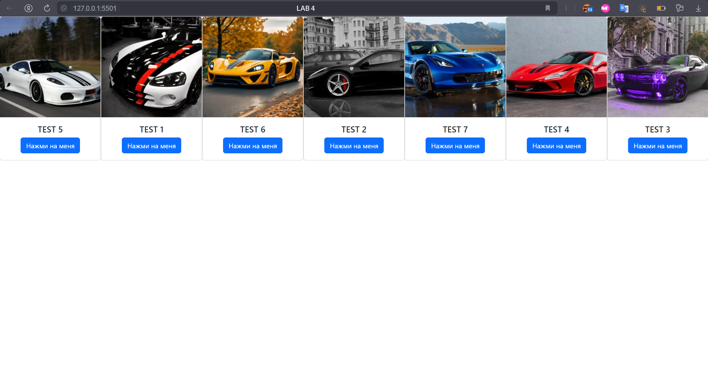
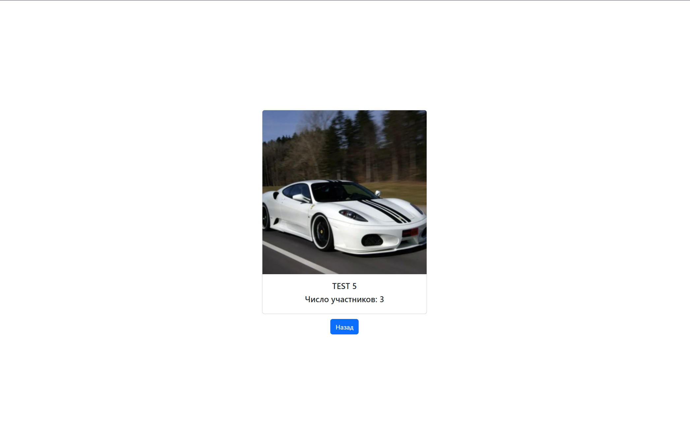

# ЛР 4. Простое веб-приложение. Работа с Api

## Задание
- Ознакомиться с VK API
- Ознакомиться с XMLHttpRequest
- Выполнить задание по 4 варианту

## Задание с практики
- Переписать код с ипользованием TypeScript

## Скриншоты

