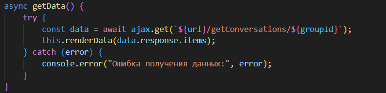
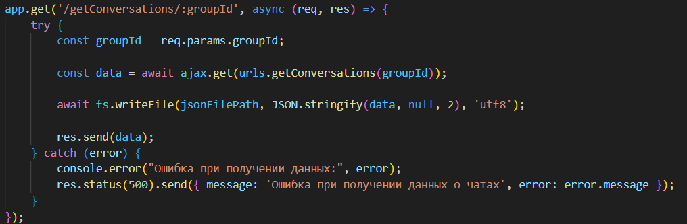
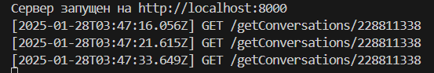
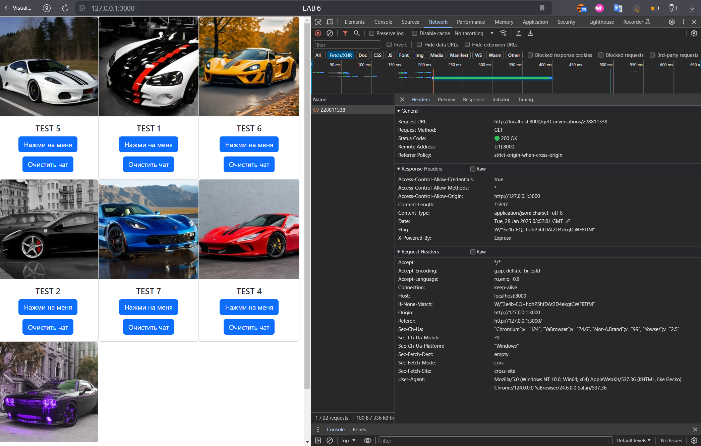

# ЛР 6. Создание сервера на Node.js

## Задание
- Написать Api с использованием библиотеки Express
- Реализовать BFF

## Реализация 

С фронтед - стороны я отправляю запрос на бэкэнд 

Далее бэкенд отправляет запрос к VK API используя токен 

На сервере можно увидеть какие запросы к нему приходят

Запрос с клиента
