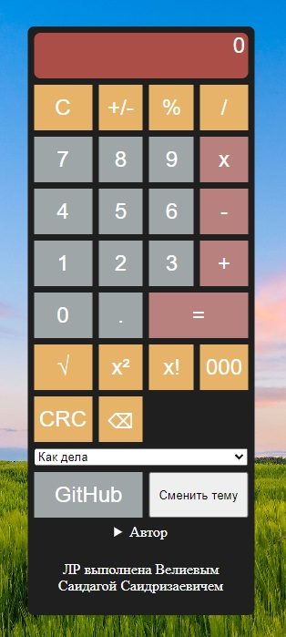

# Скриншоты
### Калькулятор:


# Выполненые задания
### Основные
- Ознакомился с HTML, CSS, JavaScript
- Создал макет калькулятора 
- Написать логику работы калькулятора 
### Дополнительные
- Поменял цветовую палитру калькулятора с оранжево-серой на любую другую;
- Изменил фон калькулятора;
- Изменил форму кнопок;
- Изменил цвет поля вывода результата;
- Скруглил края поля вывода;
- Поменял шрифт цифр;
- Сделал шрифт более толстым;
- Изменил цвет при наведении мышки на кнопку на другой;
- Добавил надпись "ЛР выполнена ФИО"(находиться внутри разворачивающегося списка с информацией);
- Выровнял калькулятор по центру;
- Увеличил размер окна вывода;
- Добавил кнопку для смены темы;
- Сделал шрифт тоньше;
- Сменил цвет шрифта;
- Добавил изображение на фон;
- Добавил кнопку со ссылкой на GitHub(находиться внутри разворачивающегося списка с информацией);
- Сделал поле с выпадающим списком;
- Сделайте сворачивающиеся и разворачивающиеся подробности;
- Добавьте поле с целью ЛР и подсветить слова: знакомство, HTML, CSS(находиться внутри разворачивающегося списка с информацией).
- Запрограммируйте операцию смены знака +/-;
- Запрограммируйте операцию вычисления процента %;
- Добавьте кнопку стирания введенной цифры назад (backspace). Расположить кнопку можно, например, на месте нерабочих +/- и % кнопок;
- Сделайте смену цвета фона по кнопке;
- Запрограммируйте операцию вычисления квадратного корня √;
- Запрограммируйте операцию возведения в квадрат x²;
- Запрограммируйте операцию вычисления факториала x!;
- Добавьте кнопку, которая за раз добавляет сразу три нуля (000);
- Запрограммируйте накапливаемое сложние;
- Запрограммируйте накапливаемое вычитание;
- Сделайте смену цвета окна вывода результата по кнопке.
### Задание с практики
- Добавить изменение цвета фона в зависимости от темы системы

___

# HTML-code
``` html
<!DOCTYPE html>
<html lang="ru">

<head>
  <meta charset="UTF-8"> 
  <title>Калькулятор</title>
  <link rel="stylesheet" href="style.css">
  <script type="text/javascript" src="script.js"></script>
</head>

<body>
  
  <div class="all_ground">

    <div id="result" class="result">
      0
    </div>

    <button id="btn_op_clear" class="my-btn secondary">C</button>
    <button id="btn_op_sign" class="my-btn secondary">+/-</button>
    <button id="btn_op_percent" class="my-btn secondary">%</button>
    <button id="btn_op_div" class="my-btn secondary">/</button>

    <button id="btn_digit_7" class="my-btn">7</button>
    <button id="btn_digit_8" class="my-btn">8</button>
    <button id="btn_digit_9" class="my-btn">9</button>
    <button id="btn_op_mult" class="my-btn primary">x</button>

    <button id="btn_digit_4" class="my-btn">4</button>
    <button id="btn_digit_5" class="my-btn">5</button>
    <button id="btn_digit_6" class="my-btn">6</button>
    <button id="btn_op_minus" class="my-btn primary">-</button>

    <button id="btn_digit_1" class="my-btn">1</button>
    <button id="btn_digit_2" class="my-btn">2</button>
    <button id="btn_digit_3" class="my-btn">3</button>
    <button id="btn_op_plus" class="my-btn primary">+</button>

    <button id="btn_digit_0" class="my-btn">0</button>
    <button id="btn_digit_dot" class="my-btn">.</button>
    <button id="btn_op_equal" class="my-btn primary execute">=</button>

   
    <button id="btn_op_sqrt" class="my-btn secondary">√</button>
    <button id="btn_op_square" class="my-btn secondary">x²</button>
    <button id="btn_op_factorial" class="my-btn secondary">x!</button>
    <button id="btn_op_triple_zero" class="my-btn secondary">000</button>
    <button id="btn_op_change_result_color" class="my-btn secondary">CRC</button>
    <button id="btn_op_backspace" class="my-btn secondary">⌫</button>


    <select>
      <option>Как дела</option>
      <option>Привет</option>
    </select>

    <button id="gitlink" class="my-btn" onclick="location.href='https://github.com/DokinsKING'">
      GitHub
    </button>

    <button id="change-theme">
      Сменить тему
    </button>
    
    <details>
      <summary>Автор</summary>
      <mark>ФИО</mark>: Велиев Саидага Саидризаевич
    </details>

    <p>ЛР выполнена Велиевым Саидагой Саидризаевичем</p>


  </div>
</body>
</html>
```
# CSS
```css
body
{
    background-image: url("depositphotos_53106465-stock-photo-beautiful-morning-light-in-public.jpg");
    background-repeat: no-repeat;
    background-size: cover;
    background-attachment: fixed; /* Закрепляет фон */
}

.all_ground
{
    display: grid;
    grid-template-columns: repeat(4, 1fr);
    gap: 7px;
    padding: 7px;
    background-color: #1f1f1f;
    border-radius: 7px;
    width: 235px;
    position: absolute;
    top: 50%;
    left: 50%;
    transform: translate(-50%, -50%);
    text-align: center;
}
.result 
{ 
    grid-column: 1 / -1;
    height: 50px;
    padding-right: 3px;
        /* отступ снизу */
    background: #aa4e47; /* цвет можно задавать и таким образом */
    text-align: right;           /* примагнитим текст к правой стороне */
    color: #ffffff;              /* цвет текста белый */
    font-size: 1.5rem;
    font-family: Arial, Helvetica, sans-serif;
    border-radius: 7px;
    white-space: nowrap; /* не переносить текст на новую строку */
    overflow-x: auto; /* добавляем горизонтальную прокрутку */
}
.my-btn 
{ 
               /* задаем ширину кнопки */
    height: 50px;                /* задаем высоту кнопки */
    /*border-radius: 50%;          /* округляем кнопку */
    border: none;                /* отключаем обводку */
    background: #9ea7a7;         /* задаем серый цвет кнопки */
    color: white;                /* задаем белый цвет текста внутри кнопки */
    font-size: 1.5rem;           /* увеличим размер шрифта */
    font-family: Arial, Helvetica, sans-serif; /* сменим шрифт */
    cursor: pointer;             /* при наведении на кнопку курсор будет изменен
    user-select: none;           /* отключаем возможность выделить текст внутри кнопки */
} 

.my-btn:hover 
{
    background: darkgray; /* при наведение курсора на кнопку, она будет окрашена в серый */
}
  
.my-btn:active 
{
    filter: brightness(130%); /* увеличим интенсивность цвета для эффекта вспышки */
}

.my-btn.primary 
{ 
    background: #b9817d; /* цвет кнопки оранжевый */
}

.my-btn.secondary 
{ 
    background: #e6b368; /* цвет кнопки сервый */
}
  
  /* селектор для кнопки расчета выражения (=) */
.my-btn.execute 
{ 
    grid-column: span 2;        /* сделаем кнопку шире других */
    /* border-radius: 34px;   /* подкорректируем округлость */
}
  
  /* селектор для поля вывода результата */
p
{
    color: white;
    grid-column: 1 / -1;
}
select
{
    grid-column: 1 / -1;
}
#gitlink
{
    grid-column: span 2; /* Занимает всю ширину */
    width: 100%;
}
#change-theme
{
    grid-column: span 2;
}
details
{
    color: white;
    grid-column: 1 / -1;
}

@media (prefers-color-scheme: light) {
    .calculator {
        background-color: #ffffff;
    }
    .my-btn {
        color: black; /* цвет текста */
    }
}

@media (prefers-color-scheme: dark) {
    .calculator {
        background-color: #444444;
    }
    .my-btn {
        color: white; /* цвет текста */
    }
}
```
# JavaScript
``` js
window.onload = function () {
    let colors = ["rgb(31, 31, 31)", "rgb(255, 255, 255)"];
    let a = '';
    let b = '';
    let expressionResult = '';
    let selectedOperation = null;
    let last = []

    let outputElement = document.getElementById("result");
    const digitButtons = document.querySelectorAll('[id^="btn_digit_"]');

    function upd_disp() {
        // Обновляем отображение текущего выражения
        if (selectedOperation) {
            outputElement.innerHTML = `${a} ${selectedOperation} ${b}`;
        } else {
            outputElement.innerHTML = a || '0'; // Показываем 0, если a пусто
        }
    }

    function onDigitButtonClicked(digit) {
        if(outputElement.innerHTML == "Infinity" && digit == '.') return;
        else if(outputElement.innerHTML == "Infinity" && digit != '.') a = '';
        else if(digit == '.' && a == '') a += 0;
        else if((a == '0' || b == '0') && digit == '0') return;

        if (!selectedOperation) {
            if ((digit != '.') || (digit == '.' && !a.includes(digit))) 
            {
                if(a == '0' && digit != '0' && digit != '.') a = ''
                a += digit;
                upd_disp();
                last = [];
            }
        } else {
            if ((digit != '.') || (digit == '.' && !b.includes(digit) && b != '')) 
                {
                if(b == '0' && digit != '0' && digit != '.') b = ''
                b += digit;
                upd_disp();
            }
        }
        outputElement.scrollLeft = outputElement.scrollWidth;
    }

    digitButtons.forEach(button => {
        button.onclick = function () {
            const digitValue = button.innerHTML;
            onDigitButtonClicked(digitValue);
        };
    });

    function setOperation(op) {
        if (a === '') return;
        selectedOperation = op;
        upd_disp();
    }

    function getEqual(selectedOperation,a,b)
    {
        expr = 0;
        switch (selectedOperation) {
            case 'x':
                expr = (+a) * (+b);
                break;
            case '+':
                expr = (+a) + (+b);
                break;
            case '-':
                expr = (+a) - (+b);
                break;
            case '/':
                expr = (+a) / (+b);
                break;
        }
        return expr;
    }

    document.getElementById("btn_op_mult").onclick = function () { setOperation('x'); };
    document.getElementById("btn_op_plus").onclick = function () { setOperation('+'); };
    document.getElementById("btn_op_minus").onclick = function () { setOperation('-'); };
    document.getElementById("btn_op_div").onclick = function () { setOperation('/'); };

    document.getElementById("btn_op_clear").onclick = function () {
        a = '';
        b = '';
        selectedOperation = null;
        expressionResult = '';
        outputElement.innerHTML = '0'; // Обновляем на 0
    };

    document.getElementById("btn_op_sign").onclick = function () {
        if (!selectedOperation) {
            a = (-a).toString();
            upd_disp();
        } else {
            b = (-b).toString();
            upd_disp();
        }
    };

    document.getElementById("btn_op_percent").onclick = function () {
        if (!selectedOperation) {
            a = (a / 100).toString();
            upd_disp();
        } else {
            b = (b / 100).toString();
            upd_disp();
        }
    };

    document.getElementById("btn_op_backspace").onclick = function () {
        if (!selectedOperation) {
            a = a.slice(0, -1);
            upd_disp();
        } else {
            b = b.slice(0, -1);
            upd_disp();
        }
    };

    document.getElementById("btn_op_sqrt").onclick = function () {
        if (!selectedOperation) {
            a = Math.sqrt(a).toString();
            upd_disp();
        }
    };

    document.getElementById("btn_op_square").onclick = function () {
        if (!selectedOperation) {
            a = Math.pow(a, 2).toString();
            upd_disp();
        }
    };

    
document.getElementById("btn_op_factorial").onclick = function() {
    function factorial(n) {
        if(n > 170) return outputElement.innerHTML = "Infinity";
        return ((n != 1) ? n * factorial(n - 1) : 1);
    }

    if (!selectedOperation && a !== '') {
        a = factorial(a).toString();
        if(a == "Infinity")
        {
            a = '';
            return;
        }
        outputElement.innerHTML = a;
    } else if (b !== '') {
        b = factorial(b).toString();
        if(b == "Infinity")
        {
            a = '';
            b = '';
            selectedOperation = null;
            return;
        }
        expressionString = a + ' ' + selectedOperation + ' ' + b;
        outputElement.innerHTML = expressionString;
    }
}

    document.getElementById("btn_op_triple_zero").onclick = function () {
        if (!selectedOperation && a != '') {
            a += '000';
            upd_disp();
        } else if (b != ''){
            b += '000';
            upd_disp();
        }
    };

    document.getElementById("change-theme").onclick = function () {
        let changebutton = document.getElementsByClassName("all_ground")[0];

        if (changebutton.style.backgroundColor === colors[0]) {
            changebutton.style.backgroundColor = colors[1];
        } else {
            changebutton.style.backgroundColor = colors[0];
        }
    };

    document.getElementById("btn_op_change_result_color").onclick = function () {
        outputElement.style.color = outputElement.style.color === 'red' ? 'black' : 'red';
    };

    document.getElementById("btn_op_equal").onclick = function () 
    {
        if(last.length === 2)
        {
            expressionResult = getEqual(last[0],a,last[1])
            a = expressionResult.toString();
            outputElement.innerHTML = a;
        }

        if (a === '' || b === '' || !selectedOperation) return;
        expressionResult = getEqual(selectedOperation,a,b)
        a = expressionResult.toString();
        last.push(selectedOperation);
        last.push(b);
        b = '';
        selectedOperation = null;
        outputElement.innerHTML = a;
    };
};
```
