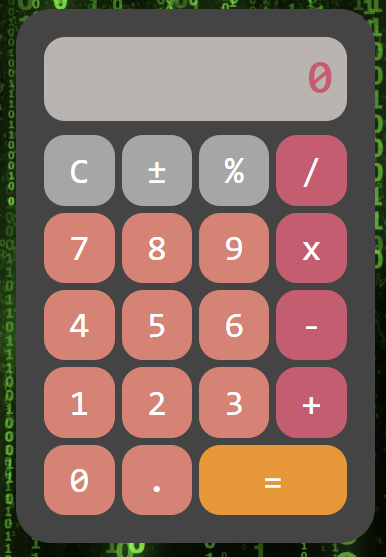
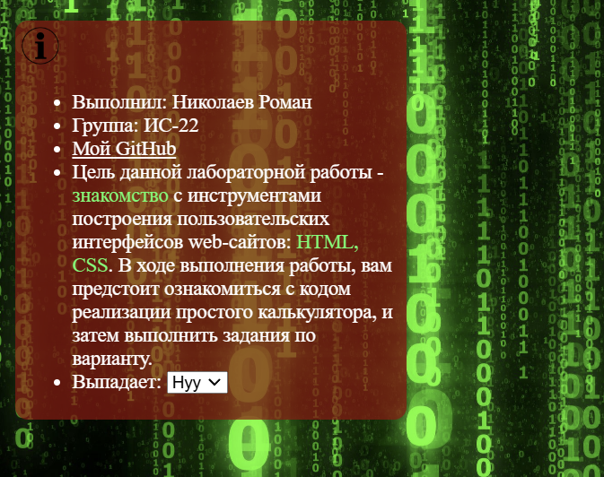

# Скриншоты
### Калькулятор:

### Выпадающее поле с информацией:


# Выполненые задания
### Основные
- Ознакомился с HTML, CSS
- Создал макет калькулятора 
### Дополнительные
- Поменял цветовую палитру калькулятора с оранжево-серой на любую другую;
- Изменил фон калькулятора;
- Изменил форму кнопок;
- Изменил цвет поля вывода результата;
- Скруглил края поля вывода;
- Поменял шрифт цифр;
- Сделал шрифт более толстым;
- Изменил цвет при наведении мышки на кнопку на другой;
- Добавил надпись "ЛР выполнена ФИО"(находиться внутри разворачивающегося списка с информацией);
- Выровнял калькулятор по центру;
- Увеличил размер окна вывода;
- Добавил кнопку для смены темы;
- Сделал шрифт тоньше;
- Сменил цвет шрифта;
- Добавил изображение на фон;
- Добавил кнопку со ссылкой на GitHub(находиться внутри разворачивающегося списка с информацией);
- Сделал поле с выпадающим списком;
- Сделайте сворачивающиеся и разворачивающиеся подробности;
- Добавьте поле с целью ЛР и подсветить слова: знакомство, HTML, CSS(находиться внутри разворачивающегося списка с информацией).
### Задание с практики
- Добавить изменение цвета фона в зависимости от темы системы

___

# HTML-code
``` html
<!DOCTYPE html>
<html lang="en">
<head>
    <meta charset="UTF-8">
    <meta name="viewport" content="width=device-width, initial-scale=1.0">
    <title>Calc</title>
    <link rel="stylesheet" href="style.css">
</head>
<body>
    <details> <!-- тут создаётся разворачивающийся список(задание 18) --> 
        <summary style="list-style: none;">
            
        </summary>
        <ul>
            <li>Выполнил: Николаев Роман</li> <!-- Задание 9 -->
            <li>Группа: ИС-22</li>
            <li><a href="https://github.com/uh-well-niko" class="link-git" target="_blank">Мой GitHub</a></li> <!-- тут добавляется ссылка на Github(задание 16) -->
            <li>
                Цель данной лабораторной работы - <span style="color:rgb(0, 255, 98)">знакомство</span> <!-- тут подсвечиваются слова(задание 19) -->
                с инструментами построения пользовательских интерфейсов web-сайтов:
                <span style="color:rgb(0, 255, 98)">HTML, CSS</span>.
                В ходе выполнения работы, вам предстоит ознакомиться с кодом реализации простого
                калькулятора, и затем выполнить задания по варианту.
            </li>
            <li>
                <label for="options">Выпадает:</label>
                <select id="options" name="options"> <!-- тут создаётся выпадающий список(задание 17) -->
                    <option value="option1">Нуу</option>
                    <option value="option2">Эээ</option>
                    <option value="option3">Даа</option>
                </select>
            </li>
        </ul>
    </details>
    
    <button id="btn_toggle_background"></button> <!-- тут добавляется кнопка для смены фона(задание 12) -->

    <div class="calculator">
        <div id="result_field" class="result">0</div>
        <div class="my-btn-grid">
            <button id="btn_op_clear" class="my-btn secondary">C</button>
            <button id="btn_op_sign" class="my-btn secondary">±</button>
            <button id="btn_op_percent" class="my-btn secondary">%</button>
            <button id="btn_op_div" class="my-btn primary">/</button>

            <button id="btn_digit_7" class="my-btn">7</button>
            <button id="btn_digit_8" class="my-btn">8</button>
            <button id="btn_digit_9" class="my-btn">9</button>
            <button id="btn_op_mult" class="my-btn primary">x</button>
            
            <button id="btn_digit_4" class="my-btn">4</button>
            <button id="btn_digit_5" class="my-btn">5</button>
            <button id="btn_digit_6" class="my-btn">6</button>
            <button id="btn_op_minus" class="my-btn primary">-</button>
            
            <button id="btn_digit_1" class="my-btn">1</button>
            <button id="btn_digit_2" class="my-btn">2</button>
            <button id="btn_digit_3" class="my-btn">3</button>
            <button id="btn_op_plus" class="my-btn primary">+</button>

            <button id="btn_digit_0" class="my-btn">0</button>
            <button id="btn_digit_dot" class="my-btn">.</button>
            <button id="btn_op_equal" class="my-btn primary execute">=</button>
        </div>
    </div>
</body>
</html>
```
# CSS
```css
.my-btn-grid{
    display: grid;
    grid-template-columns: repeat(4, 1fr);
    gap: 5px;
}

.my-btn{
    height: 50px;
    width: 50px;
    border-radius: 15px; /* тут меняется форма кнопок(задание 3) */
    border: none;
    background: #eb7e70; /* тут меняется цвет кнопок(задание 1) */
    cursor: pointer;
    font-size: 1.6rem; /* тут меняется размерт шрифта(задание 13) */
    font-weight: bold;  /* тут меняется шрифта на толстый(задание 7) */
    font-family: Andale Mono, monospace; /* тут менятеся шрифт(залание 6) */
    color: white;  /* тут меняется цвет шрифта(задание 14) */
}

.my-btn:hover {
    filter: brightness(90%); /* тут меняется цвет кнопки при наведении(задание 8) */
}

.my-btn:active {
    filter: brightness(115%);
}

.my-btn.primary { 
    background: #dd546e; /* тут меняется цвет кнопок(задание 1) */
}

.my-btn.secondary { 
    background: #a6a6a6; /* тут меняется цвет кнопок(задание 1) */
}

.my-btn.execute {
    width: 100%;
    background: #ff9100; /* тут меняется цвет кнопок(задание 1) */
    grid-column: span 2 / span 2;
}

.calculator{
    margin-top: 20px;
    padding: 20px;
    border-radius: 25px;
    background-color: #444444; /* тут меняется цвет фона (задание 2) */
}

.result{
    width: 195px;
    height: 40px; /* тут меняется размер поля вывода(задание 11) */
    overflow-x: auto;
    scrollbar-width: none;
    background-color: #ede2dcb4;
    color: #dd546e; /* тут меняется цвет поля(задание 4) */
    text-align: right;
    padding: 10px;  
    font-size: 2rem;
    font-family: Andale Mono, monospace;
    font-weight: bold;
    border-radius: 15px 15px 0px 0px;
    margin-bottom: 10px;
    border-radius: 15px; /* тут меняется форма поля вывода(задание 5)*/
}

body{
    width: 100vw;
    height: 100vh;
    margin: 0;
    display: grid; /* тут калькултор выравниватеся во центру(задание 10) */
    place-items: center;
    user-select: none;
    background-image: url(image/back.png); /* тут добавляется изображение на фон(задание 15) */
    background-size: cover;
    background-position: center;
    background-repeat: no-repeat;
    background-attachment: fixed;
}

details {
    position: absolute;
    top: 20px;
    left: 20px;
    background-color: rgba(154, 2, 2, 0.7);
    color: #ffffff;
    padding: 5px;
    border-radius: 10px;
    max-width: 300px;
    border: none;
}

#btn_toggle_background{
    position: absolute;
    right: 20px;
    top: 20px;
    width: 40px;
    height: 40px;
    border-radius: 15px;
    background: linear-gradient(45deg, #000000 50%, #ffffff 50%); 
}

#btn_op_ooo{
    font-size: 1.3rem;
}
.link-git{
    color: rgb(255, 255, 255);
    cursor: pointer;
}

.info-png{
    width: 30px;
    height: 30px;
}

/* дополнительное задание: смена цвета фона в зависимости от темы системы */
/* @media (prefers-color-scheme: light) {
    .calculator {
        background-color: #ffffff;
    }
}

@media (prefers-color-scheme: dark) {
    .calculator {
        background-color: #121212;
    }
} */
```
