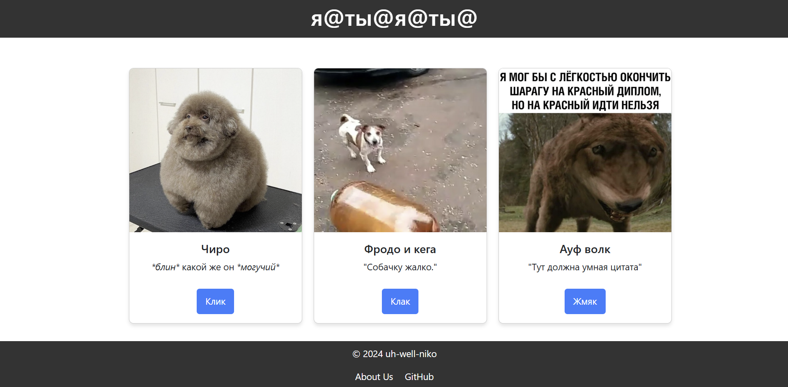
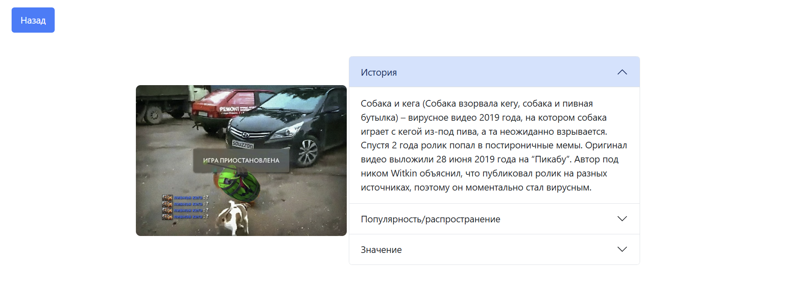

# Скриншоты

# Выполненые задания
### Основные
- Знакомство с node, npm, написание простого приложения на JavaScript.
- Ознакомиться с кодом реализации простого интерфейса и вывода данных, и затем выполнить задания по варианту. (Я выбрал вариант "Собаки и компонент - аккордеон.")
### Задание с практики
- Узнать и объяснить что такое nvm и для чего он и что такое yarn и в чём отличия от npm:
    - nvm "Node Version Manager" - инструмент, позваляющий управлять(скачивать и выбирать) несколькими версиями Node.js. Он удобен для одновременной работы с несколькими проектами.
    - yarn - это пакетный менеджер(аналог npm от Facebook). По сравнению с npm более быстрый (использует кэширование, что позволяет быстрее устанавливать ранее загруженные пакеты), более надёжный (файл yarn.lock фиксирует точные версии установленных пакетов, что делает сборку проекта предсказуемой), производит установку пакетов параллельно.
___
Вместо вставки исходного кода оставлю сыллку на репозиторий с кодом: [Исходный код lab_3](https://github.com/uh-well-niko/Web-labs-pages/tree/main/lab_3)
