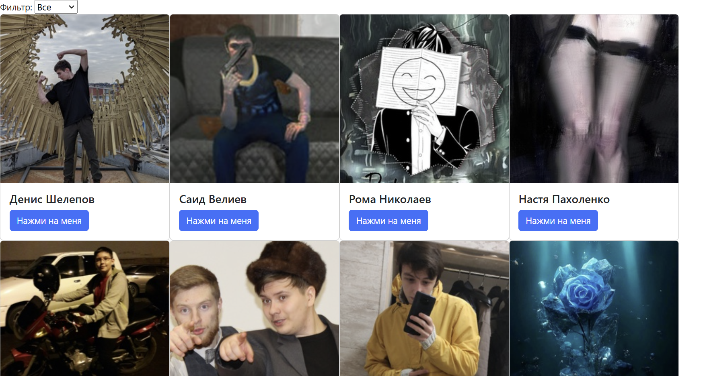
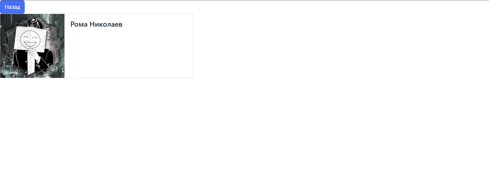
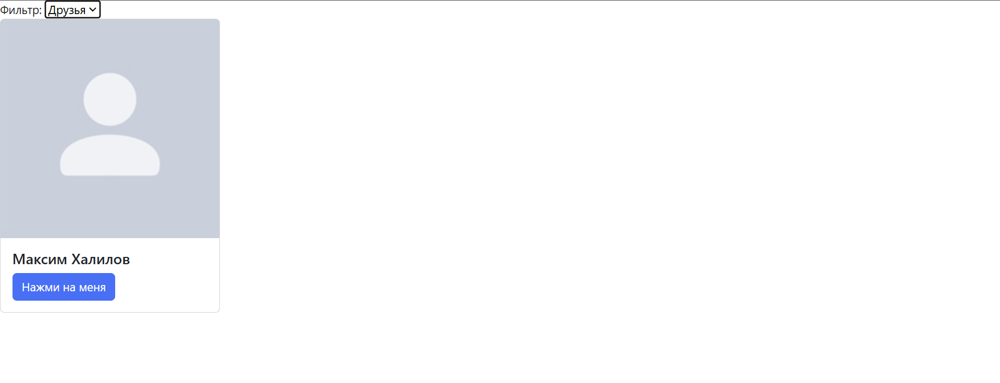

#Лабораторная работа №4
## Скриншоты

## Выполненые задания
#### Основные
- Знакомство с XMLHttpRequest
- Работа с VK Api
- Api главной страницы
- Api страницы пользователя
- Вариант 2: получить список пользователей группы и отобразить их + добавлен компонент filter. И отобразить данные пользователей.
#### Задание с практики
- Использовать axios для отправки запросов.(Файл ajax.js (Исходный код с Ajax предствлен в коде в комментариях)).
___
Вместо вставки исходного кода оставлю сыллку на репозиторий с кодом: [Исходный код lab_4](https://github.com/uh-well-niko/Web-labs-pages/tree/main/lab_4)
