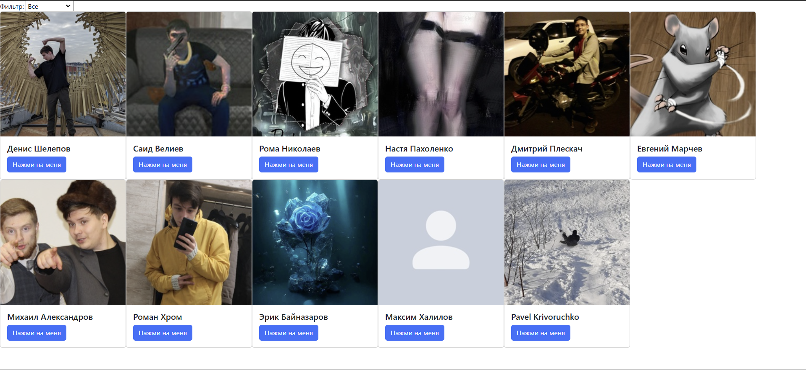
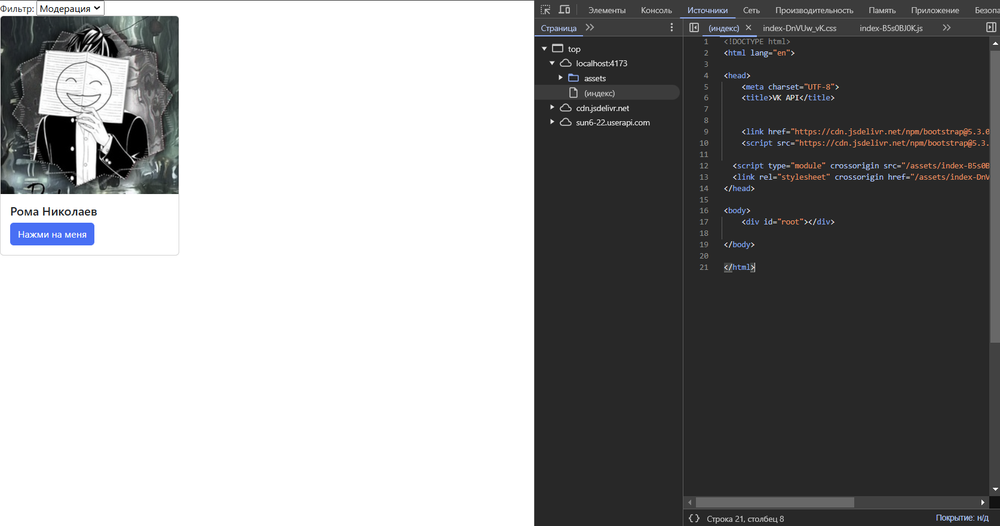

#Лабораторная работа №5
## Скриншоты

## Выполненые задания
#### Основные
- Заменить все вызовы и использования XMLHttpRequest на fetch
#### Задание с практики
- Использовать файл переменных окружения .env, чтобы скрыть ключ доступа сообщества.

Для этого я использовал vite и dotenv для сборки проект и import.meta.env для получения данных из файла .env.