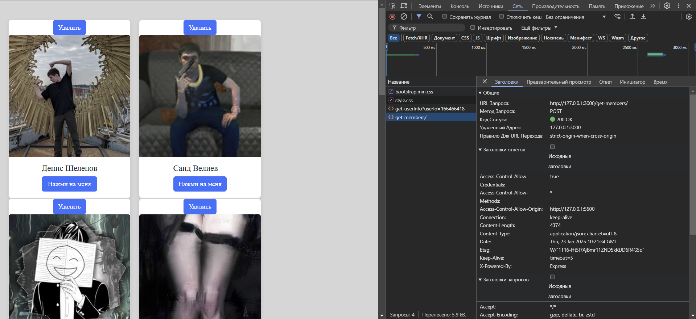
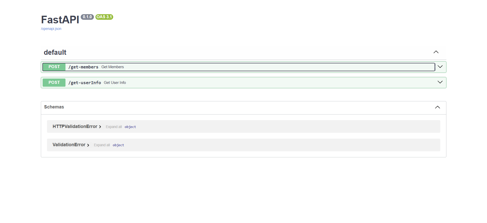
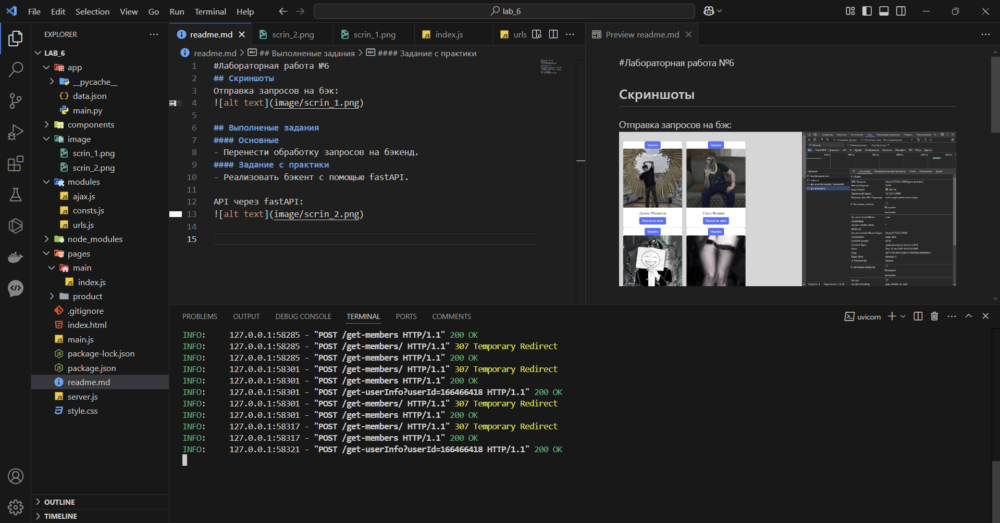

#Лабораторная работа №6
## Скриншоты
Отправка запросов на бэк:


## Выполненые задания
#### Основные
- Перенести обработку запросов на бэкенд.

Так же реализован BFF:

С фронтенд приходит запрос на мой бэкенд:
```js
app.post('/get-members', async (req, res) => {
    try {
        const members = await fetchData(groupId);
        res.json(members);
    } catch (error) {
        res.status(500).send(error.message);
    }
});
```

Далее с бэкенда я обращаюсь к API VK:
```js
async function fetchData(groupId) {
    try {
        const response = await axios.get('https://api.vk.com/method/groups.getMembers', {
            params: {
                group_id: groupId,
                sort: 'id_asc',
                fields: 'photo_400_orig',
                access_token: accessToken,
                v: version,
            },
        });
        return response.data || {};
    } catch (error) {
        throw new Error(`Ошибка при получении участников группы: ${error.message}`);
    }
}
```
___
#### Задание с практики
- Реализовать бэкент с помощью fastAPI.

API через fastAPI:


В консоли видно, что запросы отправляются:


