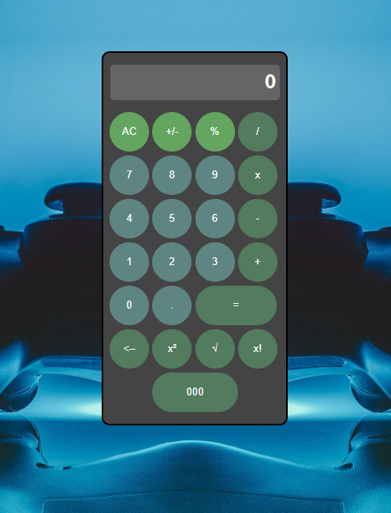

# Скриншоты
### Калькулятор:


# Выполненые задания
### Основные
- Ознакомился с HTML, CSS
- Создал макет калькулятора 
### Дополнительные
- Поменял цветовую палитру калькулятора с оранжево-серой на любую другую;
- Изменил фон калькулятора;
- Изменил форму кнопок;
- Изменил цвет поля вывода результата;
- Скруглил края поля вывода;
- Поменял шрифт цифр;
- Сделал шрифт более толстым;
- Изменил цвет при наведении мышки на кнопку на другой;
- Добавил надпись "ЛР выполнена ФИО"(находиться внутри разворачивающегося списка с информацией);
- Выровнял калькулятор по центру;
- Увеличил размер окна вывода;
- Добавил кнопку для смены темы;
- Сделал шрифт тоньше;
- Сменил цвет шрифта;
- Добавил изображение на фон;
- Добавил кнопку со ссылкой на GitHub(находиться внутри разворачивающегося списка с информацией);
- Сделал поле с выпадающим списком;
- Сделайте сворачивающиеся и разворачивающиеся подробности;
- Добавьте поле с целью ЛР и подсветить слова: знакомство, HTML, CSS(находиться внутри разворачивающегося списка с информацией).
### Задание с практики
- Добавить изменение цвета фона в зависимости от темы системы
- Переписать код на Grid

___

# HTML-code
``` html
<!DOCTYPE html>
<html lang="ru">
    <head>
        <meta charset="UTF-8">
        <title>Calculator</title>
        <link rel="stylesheet" href="style.css"/>
        <script type="text/javascript" src="script.js"></script>
    </head>


    <body>
        
        <button id="theme-toggle"></button>
        
        
        <div class="sloy">
            
            <div id="result">
                0
            </div>

            <div class="calc">

                <button id="btn_op_clear" class="my_but secondary">AC</button>
                <button id="btn_op_sign" class="my_but secondary">+/-</button>
                <button id="btn_op_percent" class="my_but secondary">%</button>
                <button id="btn_op_div" class="my_but primary">/</button>                
                
                <button id="btn_digit_7" class="my_but">7</button>
                <button id="btn_digit_8" class="my_but">8</button>
                <button id="btn_digit_9" class="my_but">9</button>
                <button id="btn_op_mult" class="my_but primary">x</button>
                
                
                <button id="btn_digit_4" class="my_but">4</button>
                <button id="btn_digit_5" class="my_but">5</button>
                <button id="btn_digit_6" class="my_but">6</button>
                <button id="btn_op_minus" class="my_but primary">-</button>
            

                <button id="btn_digit_1" class="my_but">1</button>
                <button id="btn_digit_2" class="my_but">2</button>
                <button id="btn_digit_3" class="my_but">3</button>
                <button id="btn_op_plus" class="my_but primary">+</button>
                
                <button id="btn_digit_0" class="my_but">0</button>
                <button id="btn_digit_dot" class="my_but">.</button>
                <button id="btn_op_equal" class="my_but primary execute" >=</button>

                <button id="btn_op_backspace" class="my_but primary"><–</button>
                <button id="btn_op_stepen" class="my_but primary">x²</button>
                <button id="btn_op_coren" class="my_but primary">√</button>
                <button id="btn_op_factorial" class="my_but primary">x!</button>
                <button id="btn_op_three_zero" class="my_but primary">000</button>

            </div>
            
        </div>
        
        <details id="info" >
            <summary> 
                 
            </summary>
            <ul>
                <li>Халилов Максим ИС-22</li>
                <li><a href="https://github.com/Nixz69" target="_blank" id="github">Github</a></li>
            </ul>
        </details>

        <div class="ans">
            Лабараторная работа Халилов Максим 1: Знакоство <mark>HTML</mark> и <mark>CSS</mark>
        </div>
        
        
    </body>
</html>
```
# CSS
```css
body{
    margin: 0;
    width: 100vw;
    height: 100vh;
    display: grid;
    place-items: center;
    user-select: none;
    font-family: 'Lucida Sans', 'Lucida Sans Regular', 'Lucida Grande', 'Lucida Sans Unicode', Verdana, sans-serif;
}


.my_but{
    margin: 5px 0 0 1px;
    color: #ffffff;
    background: rgb(95, 133, 131);
    border: 0;
    cursor: pointer;
    width: 50px;
    height: 50px;
    border-radius: 50px;
}


.dark-theme .my_but{
    background: #696868;
    color: white;
}

.dark-theme .primary{
    background: #3f3f3f;
    color: white;
}
.dark-theme .secondary{
    background: #3f3232;
}
.dark-theme .sloy{
    background: #ababab;
}
.dark-theme #result{
    background: #000;
    
}

.my_but:hover{
    background: rgb(95, 91, 91);
}
.my_but:active {
    filter: brightness(130%); /* увеличим интенсивность цвета для эффекта вспышки */
}
.primary {
    background: #537b5e;
}

.secondary {
    background: #64a560 ;
}

.execute {
    display: grid;
    grid-column: span 2 / span 2;
    place-items: center;
    width: 95%;
    
}

.sloy{
    border: solid 2px black;
    border-radius: 10px;
    background: #d5d5d5;
    user-select: none; 
    padding: 0 8px 15px 7px;
} 

@media (prefers-color-scheme: light) {
    .sloy {
        background-color: #ffffff;
    }
    .my_but {
        color: black; /* цвет текста */
    }
}

@media (prefers-color-scheme: dark) {
    .sloy {
        background-color: #444444;
    }
    .my_but {
        color: white; /* цвет текста */
    }
}
#result{
    width: 210px;
    height: 40px;
    margin: 15px 0px 10px 2px;
    padding: 5px 5px 0 0;
    background: #656565;
    color: white;
    text-align: right;
    font-size: 22px;
    font-weight: bold;
    border-radius: 5px;
    white-space: nowrap;
    overflow-x: auto;
    overflow-y: hidden;
    

}
.LR{
    color: rgb(196, 0, 173);
    font-size: 12px;
    
}
.link{
    color: black;
    text-decoration: none;
    color: white;
    
}
.detail{
    background: #444444;
    color: white;
    border: none;
}

.ans{
    position: absolute;
    bottom: 0px;
    color: white;
    font-size: 20px;
    font-weight: bold;
}

body{
    background-image: url(123.jpg);
    background-repeat: no-repeat;
    background-size: cover;
}
.calc
{
    display: grid;
    grid-template-columns: repeat(4,1fr);
}
#btn_op_three_zero{
    display: grid;
    grid-column: 2 / 4 ;
    width: 100%;
    place-items: center;
}
#theme-toggle{
    width: 30px;
    height: 30px;
    background-color: transparent;
    border: none;
    background-image: url(dark-mode.png);
    background-size: contain;
    background-repeat: no-repeat;
    position: absolute;
    top: 20px;
    right: 20px;
}
#info{
    position: absolute;
    top: 5px;
    left: 5px;
    color: white;

}
summary {
    list-style: none; /* Убираем стандартный треугольник раскрытия */ 
}

#github{
    color: white;
    text-decoration: none;
}
#github:hover{
    color: #b5b5b5;
}
```
