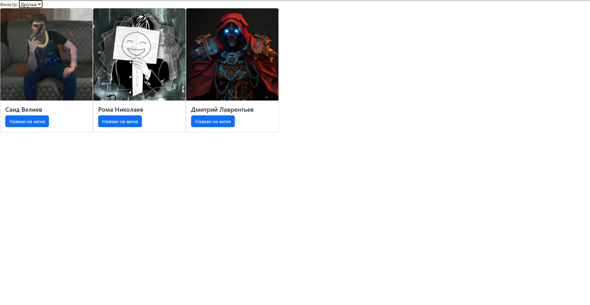

# Лабораторная работа №4 - Вариант 2
# Работа с VK_API

Создал группу добавил пользователей и по своему варианту нужно было реализовать коммпонет filter.   
---
Работа filter на отоброжение друзьей

Ccылка на репозиторий с кодом: [Исходный код lab_4](https://github.com/Nixz69/lab_web/tree/main/LB4)